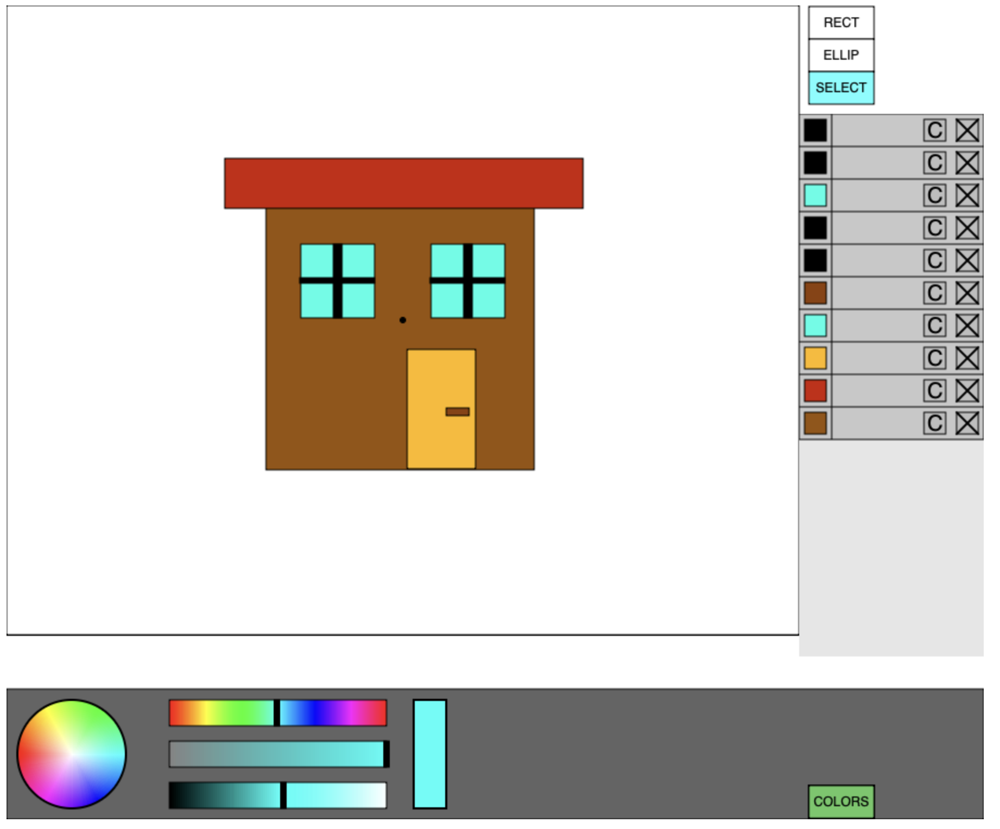
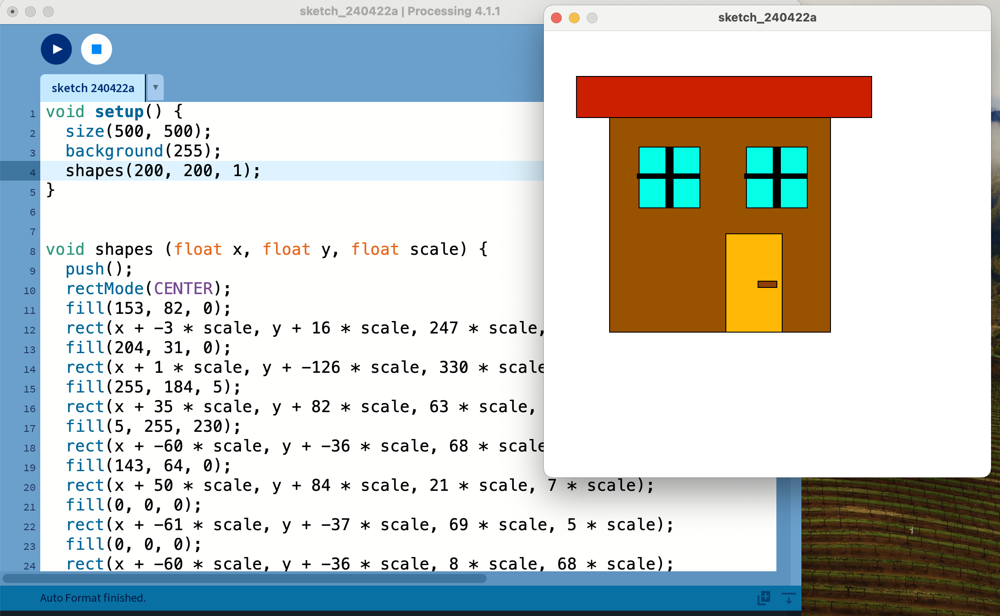

# PIllustrator

In this web application you can create new shapes and models, and use them in your processing code.

# Usage

You can create your own image.



If you press 'g' the application prints to console function, whitch you can use in your processing code.

First two arguments are for setting position. And the last argument is for appling a scale.

```javascript
void shapes (float x, float y, float scale){...}
```


